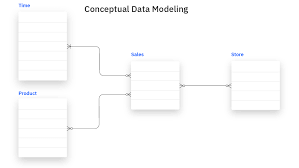
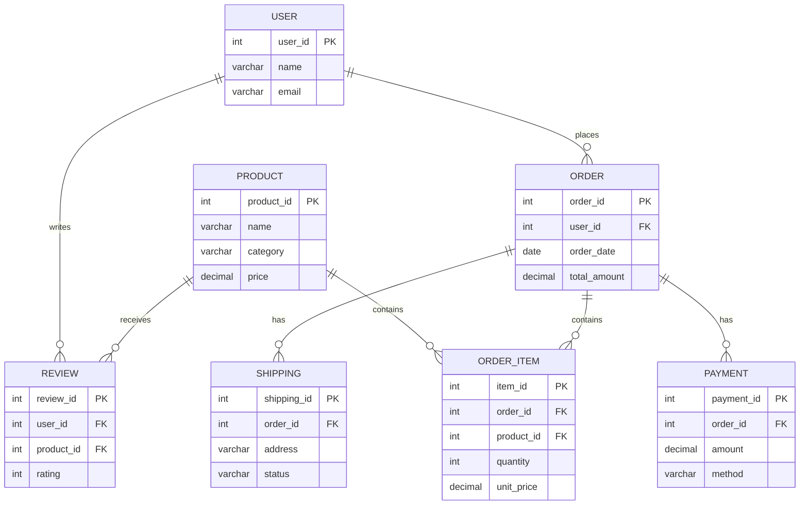
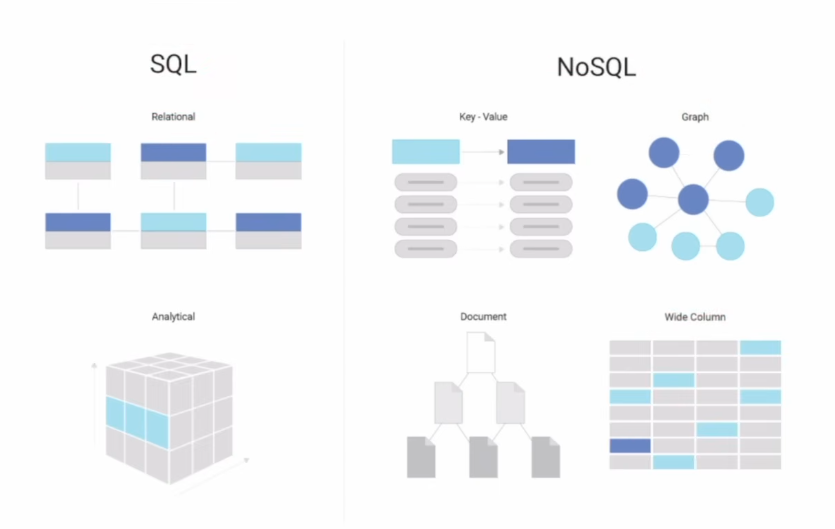
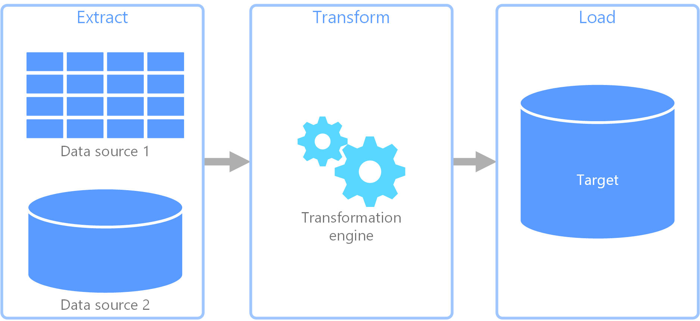

# Fundamentals of Data Engineering: Complete Master Guide

---

## 1. What is Data Engineering?

### The Big Picture

Data Engineering is the discipline of building systems and pipelines that collect, store, and prepare data for analysis. It sits at the intersection of software engineering and data science, acting as the crucial bridge between raw data generation and actionable business insights.

### Why Do Companies Need Data Engineering?

Every modern business—whether Amazon, Netflix, or a local startup—shares common goals:

- **Understand customers** to deliver better experiences
- **Increase profits** by identifying opportunities
- **Remove bottlenecks** and improve operations
- **Make data-driven decisions** instead of relying on assumptions

> **Key Insight:** While business experts can make educated guesses, **data provides factual answers**. Assumptions are flawed; data is objective.

### Where Data Engineering Fits in the Ecosystem

```
┌─────────────────────────────────────────────────────────────┐
│                    THE DATA ECOSYSTEM                       │
├─────────────────────────────────────────────────────────────┤
│                                                             │
│  [Applications / IoT / APIs / Logs]                        │
│         ↓ (Data Generation)                                │
│  [DBMS - OLTP Systems]  ←── Software Engineers, DBAs      │
│         ↓                                                  │
│  [DATA ENGINEERING]     ←── Builds pipelines & infra      │
│         ↓                                                  │
│  [Data Warehouse / Data Lake]                              │
│         ↓                                                  │
│  [Data Science / Analytics / ML]  ←── Analysts, Scientists│
│                                                             │
└─────────────────────────────────────────────────────────────┘
```

### Key Roles in the Data Ecosystem

| Role | Primary Responsibility |
|:---|:---|
| **Software Engineer** | Builds applications that generate data |
| **Database Administrator (DBA)** | Manages and optimizes transactional databases |
| **Data Engineer** | Builds ETL pipelines, integrates data, ensures quality |
| **Data Analyst** | Answers "What happened?" via dashboards and reports |
| **Data Scientist** | Answers "What will happen?" via predictive models |
| **ML Engineer** | Deploys and automates models in production |

> **Note:** In smaller organizations, one person often handles multiple roles. Focus on understanding responsibilities, not just job titles.

---

## 2. The Data Engineering Lifecycle

The lifecycle is a structured approach that transforms raw data into business value. Each stage serves a specific purpose.


```
┌──────────────────────────────────────────────────────────────┐
│               DATA ENGINEERING LIFECYCLE                    │
├──────────────────────────────────────────────────────────────┤
│                                                              │
│  1. DATA GENERATION    ←  RDBMS, APIs, IoT, Logs           │
│         ↓                                                   │
│  2. DATA INGESTION     ←  Connecting to sources            │
│         ↓                                                   │
│  3. DATA STORAGE       ←  Raw data landing zone            │
│         ↓                                                   │
│  4. DATA TRANSFORMATION ← Cleaning, joining, aggregating   │
│         ↓                                                   │
│  5. DATA SERVING       ←  Warehouses, dashboards, ML      │
│                                                              │
└──────────────────────────────────────────────────────────────┘
```

### Stage 1: Data Generation

Data originates from numerous sources:

- **RDBMS / Transactional Systems** → Application databases (PostgreSQL, MySQL)
- **APIs** → Third-party integrations, payment gateways
- **IoT Devices** → Sensors on vehicles, machinery, wearables
- **Logs & Machine Data** → Server logs, application telemetry
- **Social Media** → Clickstreams, comments, shares, likes

### Stage 2: Data Ingestion

The process of establishing connections to data sources and programmatically pulling or receiving data into your infrastructure.

**Common Approaches:**
- **Batch Ingestion:** Scheduled extracts (e.g., nightly ETL jobs)
- **Streaming Ingestion:** Real-time data feeds (e.g., Apache Kafka)

### Stage 3: Data Storage

Raw data requires a landing zone. Storage choices depend on data type, volume, and velocity.

| Storage Type | Examples | Use Case |
|:---|:---|:---|
| **Relational DB** | PostgreSQL, MySQL | Transactional systems |
| **NoSQL DB** | MongoDB, Cassandra | Unstructured, high-velocity data |
| **Data Warehouse** | Snowflake, BigQuery, Redshift | Structured analytics |
| **Object Storage** | AWS S3, GCS, Azure Blob | Low-cost, scalable storage |
| **Data Lake** | Hadoop, Delta Lake | Raw data in any format |

> **Perspective Note:** Relational databases serve dual roles. From an application viewpoint, they're **storage**. From a data engineering viewpoint, they're **data generation sources**.

### Stage 4: Data Transformation (The Core)

This is where raw data becomes valuable. Transformations apply business logic to:

- **Standardize** data formats (e.g., all dates to `YYYY-MM-DD`)
- **Clean** data (remove duplicates, handle NULLs)
- **Join** datasets from multiple sources
- **Aggregate** data (e.g., daily total sales)
- **Filter** irrelevant records
- **Enrich** data with additional context

### Stage 5: Data Serving

The final, transformed data is delivered to end-users:

- **Data Analysts** → Build dashboards (Tableau, PowerBI)
- **Data Scientists** → Train ML models
- **ML Engineers** → Deploy models to production
- **Business Users** → View reports and KPIs

---

## 3. Database Management Systems (DBMS)

A DBMS is software that enables users to define, create, maintain, and control access to databases. Think of it as an industrial-grade Excel capable of handling billions of rows with high performance.

### Popular DBMS Examples

| Category | Examples |
|:---|:---|
| **Open Source** | PostgreSQL, MySQL |
| **Enterprise** | Oracle, Microsoft SQL Server |
| **Cloud-Native** | Amazon Aurora, Google Cloud Spanner |

### The Language: SQL (Structured Query Language)

SQL is the standard language for interacting with relational databases.

**Core Operations:**
```
SELECT  → Read data
INSERT  → Add new data
UPDATE  → Modify existing data
DELETE  → Remove data
```

---

## 4. Data Modeling

Data modeling is the process of creating a visual representation of data structures, entities, attributes, and their relationships. It ensures data is organized for efficient querying and analysis.



### The Data Modeling Process

```
BUSINESS REQUIREMENTS
        ↓
   Identify Data
        ↓
   Define Entities & Attributes
        ↓
   Define Relationships
        ↓
   Create Visual Model (ERD)
        ↓
   Query & Analysis
```

### Example: E-Commerce Data Model

For an e-commerce platform, typical entities include:

- **Users** → Customer information
- **Products** → Catalog items
- **Orders** → Purchase transactions
- **Order Items** → Line items within orders
- **Payments** → Transaction details
- **Shipping** → Delivery information
- **Reviews** → Customer feedback

### Relationship Types

| Notation | Meaning |
|:---|:---|
| **PK** | Primary Key - Uniquely identifies a record |
| **FK** | Foreign Key - References a record in another table |
| **1:N** | One-to-Many relationship |
| **N:1** | Many-to-One relationship |

### Business Questions This Model Answers

- "How many orders did each user place?"
- "What are our best-selling products?"
- "How much revenue did each product generate?"
- "Which payment methods are most common?"
- "What is the shipping status of each order?"

---

## Entity-Relationship Diagram

An **Entity-Relationship Diagram (ERD)** is a visual representation of the entities, their attributes, and the relationships between them.



The goal of data modeling is to create a structure that **accurately represents the business and makes the data easier to query, analyze, and use.**


## 5. SQL vs. NoSQL Databases

The distinction goes beyond the query language—it's about data structure and use cases.



### Side-by-Side Comparison

| Feature | SQL (Relational) | NoSQL (Non-Relational) |
|:---|:---|:---|
| **Schema** | Fixed, rigid | Flexible, schema-less |
| **Data Model** | Tables with relationships | Key-Value, Document, Graph, Wide-Column |
| **Query Language** | SQL (Structured) | API-specific, varies by product |
| **ACID Compliance** | Strong | Usually weaker (Eventual Consistency) |
| **Scaling** | Vertical (scale up) | Horizontal (scale out) |
| **Use Cases** | OLTP, OLAP, structured data | High-volume, unstructured, real-time |
| **Examples** | PostgreSQL, MySQL, Snowflake | MongoDB, Redis, Cassandra, Neo4j |

### Data Models in NoSQL

| Model | Description | Example |
|:---|:---|:---|
| **Key-Value** | Simple key to value mapping | Redis, DynamoDB |
| **Document** | JSON-like documents | MongoDB, Firestore |
| **Wide-Column** | Sparse, distributed columns | Cassandra, HBase |
| **Graph** | Nodes and relationships | Neo4j, Amazon Neptune |

---

## 6. OLTP vs. OLAP: The Core Processing Distinction

This is one of the most critical concepts for data engineers. OLTP and OLAP are two fundamentally different types of database systems optimized for completely different workloads.

### The Core Principle

```
OLTP = The Source of Truth    → Captures the current business state
OLAP = The Reflection         → Answers business questions with history
```

### Detailed Comparison

| Aspect | OLTP (Transactional) | OLAP (Analytical) |
|:---|:---|:---|
| **Primary Goal** | Record daily operations | Drive strategic decisions |
| **Design Motto** | "Write fast, read recent" | "Read massive, write rare" |
| **Primary Operation** | INSERT, UPDATE, DELETE | Complex SELECT queries |
| **Data Volume/Query** | Small (KB-MB) | Massive (TB-PB) |
| **User Count** | Thousands concurrent | Dozens of analysts |
| **Query Latency** | Sub-second | Seconds to minutes |
| **Data Age** | Current state ("Now") | Historical ("Time-series") |
| **Schema** | Highly Normalized (3NF) | Denormalized (Star/Snowflake) |
| **Storage Format** | Row-Oriented | Column-Oriented |
| **Transaction Model** | ACID (Strong consistency) | BASE (Eventual consistency) |
| **Hardware Focus** | High CPU speed, fast storage | Massive parallel processing, large RAM |

### Why Storage Format Matters

**OLTP - Row-Oriented:**
- All columns of a row are stored together on disk
- Perfect for retrieving a complete record quickly
- Example: `SELECT * FROM Users WHERE UserID = 12345`

**OLAP - Column-Oriented:**
- Each column is stored contiguously on disk
- Perfect for aggregating specific columns without reading unnecessary data
- Enables 90%+ compression ratios
- Example: `SELECT SUM(Sales) FROM Orders WHERE Year = 2024`

### Row vs. Column Storage Illustration

```
ROW-ORIENTED (OLTP):
| ID | Name  | Age | City  | Payment |
|----|-------|-----|-------|---------|
| 1  | Alice | 30  | NYC   | $100    |
| 2  | Bob   | 25  | LA    | $200    |
      ↑ All data in row is read together

COLUMN-ORIENTED (OLAP):
| ID  | Name   | Age | City | Payment |
|-----|--------|-----|------|---------|
| 1   | Alice  | 30  | NYC  | $100    |
| 2   | Bob    | 25  | LA   | $200    |
                            ↑ Only Payment column is read
```

---

## 7. The ETL Process

ETL (Extract, Transform, Load) is the standard process for moving data from OLTP systems to OLAP environments.



```
┌─────────────┐     ┌─────────────────┐     ┌─────────────┐
│  EXTRACT    │ ──► │   TRANSFORM     │ ──► │    LOAD     │
└─────────────┘     └─────────────────┘     └─────────────┘
      ↓                      ↓                      ↓
   OLTP Sources        Business Logic         Data Warehouse
   (Postgres)         (Clean, Join,         (Snowflake,
   (APIs)             Aggregate)            BigQuery)
   (Logs)
```

### Extract

Read data from various sources:
- RDBMS (via SQL queries or CDC)
- APIs (REST, SOAP)
- Log files (AWS CloudTrail, application logs)
- Sensors (IoT telemetry)

### Transform

Apply business logic to convert raw data into a usable format:
- Handle missing values (NULLs)
- Remove duplicates
- Standardize formats (dates, currencies)
- Join datasets (users + orders)
- Aggregate metrics
- Enrich with external data
- Validate data quality

### Load

Write the transformed data to the target system:
- **Full Load:** Replace all data
- **Incremental Load:** Only new/changed data
- **Insert-Only:** Append new records (preserves history)

### ELT: A Modern Variation

```
Extract → Load → Transform
```

In ELT, data is loaded raw into the warehouse *first*, then transformed inside using the warehouse's compute power. This approach:
- Leverages modern cloud warehouse scalability
- Reduces ETL tool complexity
- Enables "replayability" (re-process raw data anytime)
- Popular with tools like dbt (data build tool)

---

## 8. The Undercurrents: Foundations of Data Engineering

Beyond the lifecycle stages, these "undercurrents" support everything:

### Security
- Who can access what data?
- Authentication & authorization
- Encryption at rest and in transit
- Compliance (GDPR, HIPAA, etc.)

### Data Management & Governance
- **Discoverability:** Can you find the data you need?
- **Definitions:** What does each column mean?
- **Lineage:** Where did this data come from?
- **Accountability:** Who owns this data?
- **Quality:** Is the data accurate and complete?

### Data Architecture
- High-level system design
- Technology selection (trade-offs)
- Scalability planning
- Cost optimization

### Orchestration
- Scheduling jobs and workflows
- Dependency management (Job B runs after Job A)
- Retry logic and error handling
- **Key Tool:** Apache Airflow, Prefect, Dagster

### Software Engineering
- Write clean, modular, testable code
- CI/CD for data pipelines
- Version control (Git)
- Code reviews and best practices

### DataOps
- Automation of deployment and monitoring
- Observability: What's happening in your pipelines?
- Incident detection and reporting
- Continuous improvement

---

## Summary: Quick Reference Card

| Concept | Key Takeaway |
|:---|:---|
| **Data Engineering** | Building pipelines to collect, store, and prepare data |
| **Lifecycle** | Generation → Ingestion → Storage → Transformation → Serving |
| **Data Modeling** | Visual design of entities, attributes, and relationships (ERD) |
| **SQL vs NoSQL** | SQL = Structured relationships; NoSQL = Flexible, unstructured |
| **OLTP** | Transactional, row-based, ACID, fast writes, current state |
| **OLAP** | Analytical, column-based, reads-heavy, historical, warehouse |
| **ETL** | Extract → Transform → Load: Moving OLTP data to OLAP |
| **ELT** | Extract → Load → Transform: Transform inside the warehouse |
| **Undercurrents** | Security, Governance, Architecture, Orchestration, DevOps, DataOps |

---

**✅ You are now ready to move to Part 2: [Data Architecture 101 Complete Guide](./Data_Architecture_101_Complete_Guide.md)**

---

*End of Part 1: Fundamentals of Data Engineering*

---