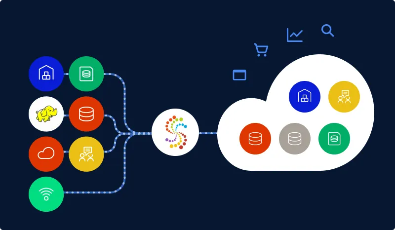
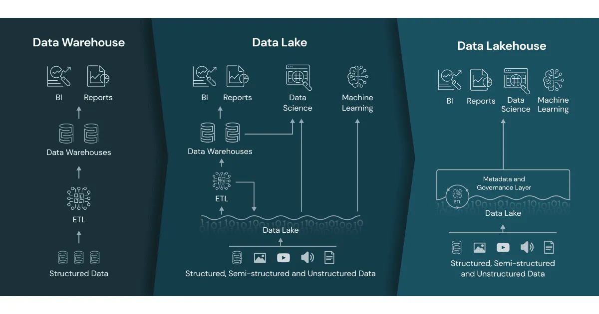
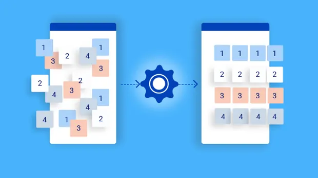
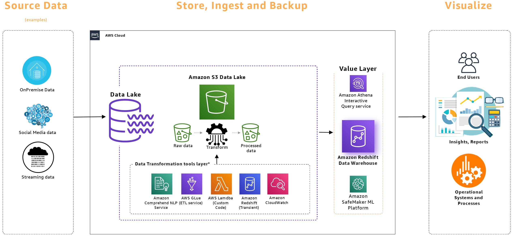

# Data Architecture 101: Complete Guide for Data Engineers

---

## 1. What is Data Architecture?

### The Technical Definition

According to *The Fundamentals of Data Engineering* by Joe Reis and Matt Housley:

> **Data architecture** is the design of systems to support the evolving data needs of an enterprise, achieved by flexible and reversible decisions reached through a careful evaluation of trade-offs.

### The Simple Analogy

Before constructing a building, architects create a **blueprint**. The blueprint includes:

- Foundation
- Floor plans
- Elevations
- Elevators and stairs
- Offices and restrooms

**Data architecture** follows the same principle. Instead of physical components, we design:

- Storage systems
- Software and tools
- Data flow paths
- Interfaces and APIs
- Transformation logic
- Staging areas
- Data warehouses
- Reporting systems
- Analytics layers

### Key Terms to Remember

| Term | Meaning |
|:---|:---|
| **Trade-offs** | Evaluating what to gain vs. what to sacrifice when choosing technologies |
| **Data Assets** | All data owned by the organization (structured, unstructured, raw, processed) |
| **Blueprint** | The visual representation of how data flows through the system |
| **Business Objectives** | The "why" behind every architectural decision |

---

## 2. The Two Parts of Data Architecture

Data architecture is divided into two complementary sides:

### Part 1: Operational Architecture (Business Needs)

**Focus:** Business goals and requirements

**Questions it answers:**
- "What is the impact of the XYZ category of product?"
- "Why is there a delay in product shipping?"
- "How do we manage data quality from third-party vendors?"

**Purpose:** Align data practices with business objectives

**This is the "WHY"** behind every piece of data collected, processed, and stored.

### Part 2: Technical Architecture (Technology Integration)

**Focus:** Technical implementation and execution

**Questions it answers:**
- "How do we ingest data from multiple sources?"
- "How do we store and transform data?"
- "What happens when we have a sudden order spike?"

**Purpose:** Use specific technologies and methodologies to meet operational goals

**This is the "HOW"** of the equation.

### The Relationship

```
┌─────────────────────────────────────────────────────────────┐
│                    DATA ARCHITECTURE                       │
├──────────────────────────────┬──────────────────────────────┤
│   OPERATIONAL ARCHITECTURE   │    TECHNICAL ARCHITECTURE   │
│   (Business Needs)           │    (Technology Integration)  │
│                              │                              │
│   • WHAT we need to achieve  │    • HOW we will achieve it  │
│   • Business goals           │    • Tools & technologies   │
│   • Stakeholder requirements │    • Data flow design        │
│   • Business impact          │    • Scalability planning    │
│                              │    • Security & governance   │
└──────────────────────────────┴──────────────────────────────┘
```

---

## 3. Operational Architecture: Aligning Data with Business Goals

Operational architecture ensures that your data practices align closely with business objectives. It's the "why" behind every piece of data you collect, process, and store.

### Key Principles

#### 1. Start with the End in Mind

Always begin by understanding the **business problem** you're trying to solve. This clarity guides decisions and ensures data architecture directly contributes to business outcomes.

**Example:** Before choosing between Snowflake and Redshift, ask: "What business problem am I solving?"

#### 2. Iterate and Evolve

Business needs change constantly:
- New product lines emerge
- Market conditions shift
- Customer preferences evolve
- Competition intensifies

Your architecture must be **agile enough to evolve**.

**Example:** Build for today's requirements but plan for tomorrow's growth. Adopt practices and technologies that allow adjustment as business strategies shift.

#### 3. Focus on Impact

Every data solution should have a clear line of sight to its **business impact**.

**Examples of business impact:**
- Improving customer satisfaction
- Streamlining operations
- Reducing costs
- Enhancing decision-making
- Increasing revenue

> **Key Insight:** The value of your data initiatives should be **measurable** and **aligned with business priorities**.

---

## 4. Technical Architecture: The Building Blocks

Technical architecture is the "how" of the equation—the specific technologies and methodologies you'll use to meet your operational goals.

### The Data Engineering Landscape

> **Note:** There are thousands of tools available. You don't have to choose from all of them. Choose what solves your business problem.

### Practical Insights for Technical Architecture

#### 1. Simplicity is Key

> **Golden Rule:** Complexity is often the enemy of effectiveness.

**Why simplicity matters:**
- Easier to maintain
- More scalable
- Less prone to errors
- Easier to debug
- Faster onboarding for new team members

**Example:** You don't need Apache Spark for 10,000 rows. A simple Python script may be all you need.

#### 2. Choose the Right Tools for the Job

> **There is no one-size-fits-all solution** in data architecture.

**Decision Factors:**
- Data volume and velocity
- Data structure (structured vs. unstructured)
- Query patterns (OLTP vs. OLAP)
- Team expertise
- Budget constraints
- Integration with existing systems

**Example Decision Tree:**
```
Do you have structured data with <100GB volume?
    → Use PostgreSQL or a simple warehouse
Do you have billions of rows and complex analytics?
    → Use Snowflake, BigQuery, or Redshift
Do you have unstructured data (images, logs)?
    → Use a Data Lake (S3, GCS)
Do you need real-time processing?
    → Use Apache Kafka + Apache Flink/Spark Streaming
```

#### 3. Build for Scale and Flexibility

> **Even if you're not dealing with big data now, plan for it.**

**Scaling Strategies:**
- Use technologies that scale **horizontally** (add more machines)
- Design architecture to be **modular**
- Start small, but make it easy to grow
- Plan for future data volume increases

**Example:** Start with a small Spark cluster, but have the ability to scale up as data volume grows.

#### 4. Embrace Automation and Orchestration

> **Don't monitor manually—automate everything.**

**What to Automate:**
- Data ingestion pipelines
- ETL/ELT processes
- Data quality checks
- Error detection and alerting
- Monitoring and observability
- Incident reporting

**Example:**
```
Instead of checking daily if your pipeline ran:
    → Set up Apache Airflow to schedule and monitor
    → Configure Slack/email alerts for failures
    → Build automated retry logic
```

#### 5. Prioritize Data Security and Governance

> **Data breaches can be catastrophic.**

**Security Requirements:**
- Data encryption (at rest and in transit)
- Role-based access control (RBAC)
- Data masking for sensitive information
- Compliance with regulations (GDPR, HIPAA, CCPA, SOX)

**Governance Requirements:**
- Data lineage (where data came from)
- Data quality monitoring
- Documentation and definitions
- Data accountability (who owns what)

---

## 5. Example: Building Data Architecture for an E-Commerce Platform

Let's bring everything together with a real-world example.

### Step 1: Define Business Needs (Operational Architecture)

| Business Goal | Specific Requirements |
|:---|:---|
| **Customer Experience** | Improve site navigation, personalize product recommendations, enhance customer service |
| **Operational Efficiency** | Streamline inventory management, optimize order processing, reduce shipping costs |
| **Marketing Insights** | Analyze customer behavior, optimize marketing strategies, improve product placement |
| **Vendor Management** | Enhance data exchange, improve product availability, optimize pricing strategies |
| **Compliance & Security** | Ensure customer data security, comply with GDPR/CCPA regulations |

### Step 2: Design Technical Architecture

#### Layer 1: Data Ingestion



**Purpose:** Collect data from various sources in real-time

**Sources:**
- Website interactions
- Server logs
- Vendor systems
- Inventory management
- Customer support

**Tools & Technologies:**
- **Apache Kafka** → Real-time streaming
- **Apache Flume** → Log data collection
- **Amazon Kinesis** → AWS-native streaming

---

#### Layer 2: Data Storage



**Purpose:** Store collected data for easy access and analysis

**Components:**

| Storage Type | Purpose | Examples |
|:---|:---|:---|
| **Data Lake** | Raw, unstructured data storage | Amazon S3, Google Cloud Storage, Azure Blob |
| **Data Warehouse** | Structured, query-able data | Snowflake, Google BigQuery, Amazon Redshift |
| **Lakehouse** | Combined data lake + warehouse | Delta Lake, Apache Iceberg, Hudi |

**Decision Factors:**
- Data volume and variety
- Query complexity
- Performance requirements
- Cost constraints

---

#### Layer 3: Data Processing & Transformation



**Purpose:** Clean, validate, and transform raw data into a structured format

**Tools & Technologies:**

| Processing Type | Tools | Use Case |
|:---|:---|:---|
| **Batch Processing** | Apache Spark, AWS Glue, Azure Data Factory | Large-scale scheduled processing |
| **Real-Time Processing** | Apache Flink, Spark Streaming, Kafka Streams | Low-latency data processing |
| **Simple Processing** | Python Pandas, SQL | Small datasets (<1M rows) |

**Transformations Applied:**
- Data cleaning (remove duplicates, handle NULLs)
- Standardization (uniform date formats, currencies)
- Data validation (quality checks)
- Data enrichment (joining with external data)
- Aggregation (daily sales totals)

---

#### Layer 4: Data Analysis & Business Intelligence

**Purpose:** Generate insights for business decisions

**Components:**

| Function | Tools | Purpose |
|:---|:---|:---|
| **Visual Analytics** | Tableau, Power BI, Looker | Interactive dashboards and reports |
| **Predictive Analytics** | TensorFlow, PyTorch, Scikit-learn | Machine learning models |
| **Ad-Hoc Analysis** | Jupyter Notebooks, SQL interfaces | Exploratory data analysis |

**Example Business Use Cases:**
- "Which products are best-sellers?" → Dashboard
- "What's our predicted revenue next quarter?" → ML model
- "Why is shipping delayed?" → Operational dashboard

---

#### Layer 5: Security & Compliance

**Purpose:** Ensure data privacy, security, and regulatory compliance

**Requirements:**
- **Regulations:** GDPR, CCPA, HIPAA, SOX
- **Access Controls:** Role-based access, multi-factor authentication
- **Encryption:** In transit (TLS) and at rest (AES-256)
- **Auditing:** Track who accessed what and when
- **Data Masking:** Hide sensitive information (credit cards, PII)

**Approach:** Integrate compliance checks into data processing workflows.

---

#### Layer 6: Data Integration & API Layer

**Purpose:** Facilitate data exchange between systems

**Integration Patterns:**
- **REST APIs** → Lightweight, flexible integration
- **GraphQL** → Complex queries from multiple sources
- **Webhooks** → Event-driven data exchange
- **Message Queues** → Reliable, asynchronous communication

**Examples:**
- Vendor data exchange
- Inventory system integration
- Customer service tool integration
- Third-party logistics integration

### Step 3: The Final Architecture



**The final architecture might look like this:**

```
┌─────────────────────────────────────────────────────────────┐
│                      DATA SOURCES                          │
├───────────┬───────────┬───────────┬───────────┬───────────┤
│ Websites  │  Mobile   │  IoT      │  Logs     │  Vendors  │
│  / Apps   │           │  Devices  │           │           │
└───────────┴───────────┴───────────┴───────────┴───────────┘
                         │
                         ▼
              ┌─────────────────┐
              │   INGESTION     │  ← Apache Kafka / Kinesis
              │   (Real-time)   │
              └────────┬────────┘
                       │
                       ▼
              ┌─────────────────┐
              │   DATA LAKE     │  ← Amazon S3 / GCS
              │   (Raw Data)    │
              └────────┬────────┘
                       │
                       ▼
              ┌─────────────────┐
              │  TRANSFORM      │  ← Apache Spark / AWS Glue
              │  (Clean/Enrich) │
              └────────┬────────┘
                       │
                       ▼
              ┌─────────────────┐
              │  DATA WAREHOUSE │  ← Snowflake / BigQuery
              │  (Structured)   │
              └────────┬────────┘
                       │
         ┌─────────────┼─────────────┐
         ▼             ▼             ▼
┌─────────────────┐ ┌─────────────┐ ┌─────────────────┐
│  BI/Dashboards  │ │  ML Models  │ │   Ad-Hoc Query  │
│  (Tableau, BI)  │ │ (TensorFlow)│ │   (Athena/SQL)  │
└─────────────────┘ └─────────────┘ └─────────────────┘
         │             │             │
         └─────────────┼─────────────┘
                       ▼
              ┌─────────────────┐
              │   USERS         │
              │  (Analysts,     │
              │   Business)     │
              └─────────────────┘
```

---

## 6. Key Takeaways

### Data Architecture Principles

| Principle | Description |
|:---|:---|
| **Simple is Better** | Avoid over-engineering. Choose the simplest solution that works. |
| **Right Tool for the Job** | No one-size-fits-all. Choose based on your specific use case. |
| **Plan for Scale** | Even if small now, design for future growth. |
| **Automate Everything** | Reduce manual intervention to minimize errors. |
| **Security First** | Embed security and governance from day one. |
| **Reversible Decisions** | Every component should be easily replaceable. |

### The Architecture Mindset

```
1. Start with Business Goals
   ↓
2. Define Operational Requirements (WHAT)
   ↓
3. Design Technical Architecture (HOW)
   ↓
4. Choose Technologies Based on Requirements
   ↓
5. Build, Test, Iterate
   ↓
6. Monitor and Evolve
```

### Common Mistakes to Avoid

| Mistake | Better Approach |
|:---|:---|
| Choosing technologies first | Start with business needs |
| Over-engineering from day 1 | Start simple, scale gradually |
| Ignoring future growth | Plan for scale but start small |
| No documentation | Document everything |
| No monitoring | Build observability from the start |
| Security as an afterthought | Embed security in every layer |

---

## 7. Summary Table: Quick Reference

| Component | Purpose | Key Tools | Considerations |
|:---|:---|:---|:---|
| **Ingestion** | Collect data from sources | Kafka, Kinesis, Flume | Real-time vs. batch |
| **Storage** | Data Lake & Warehouse | S3, Snowflake, BigQuery | Structured vs. unstructured |
| **Transformation** | Clean & Enrich data | Spark, AWS Glue, dbt | Batch vs. streaming |
| **Analysis** | Generate insights | Tableau, Power BI, TensorFlow | Dashboards vs. ML models |
| **Security** | Protect data | IAM, KMS, Data Masking | Encryption, access control |
| **Integration** | Connect systems | APIs, GraphQL, Webhooks | RESTful vs. event-driven |
| **Orchestration** | Schedule workflows | Airflow, Prefect, Dagster | Dependency management |

---


*End of Part 2: Data Architecture 101*