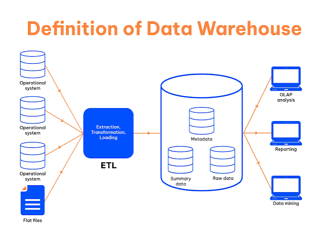
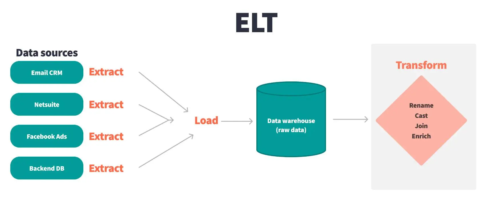
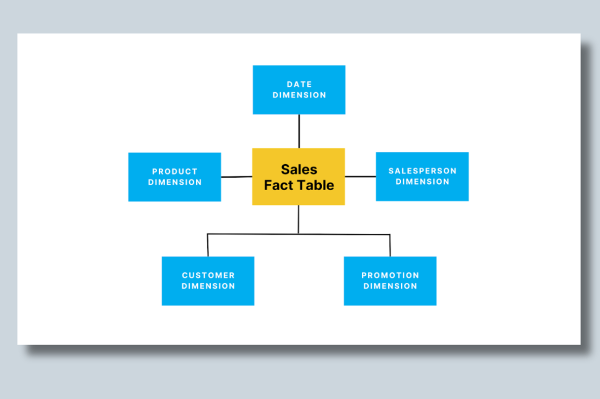
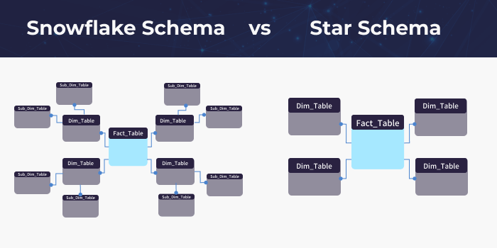
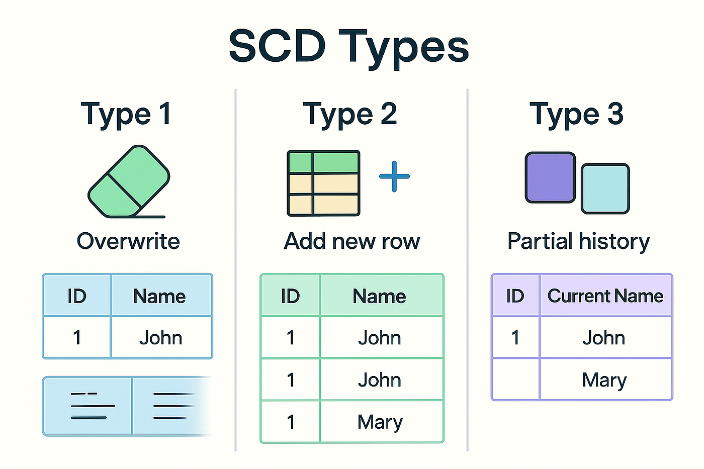
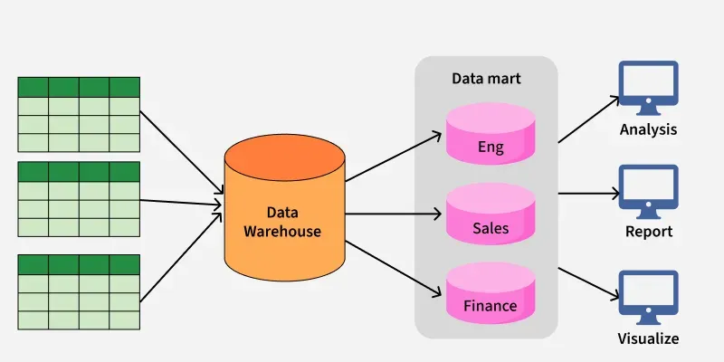
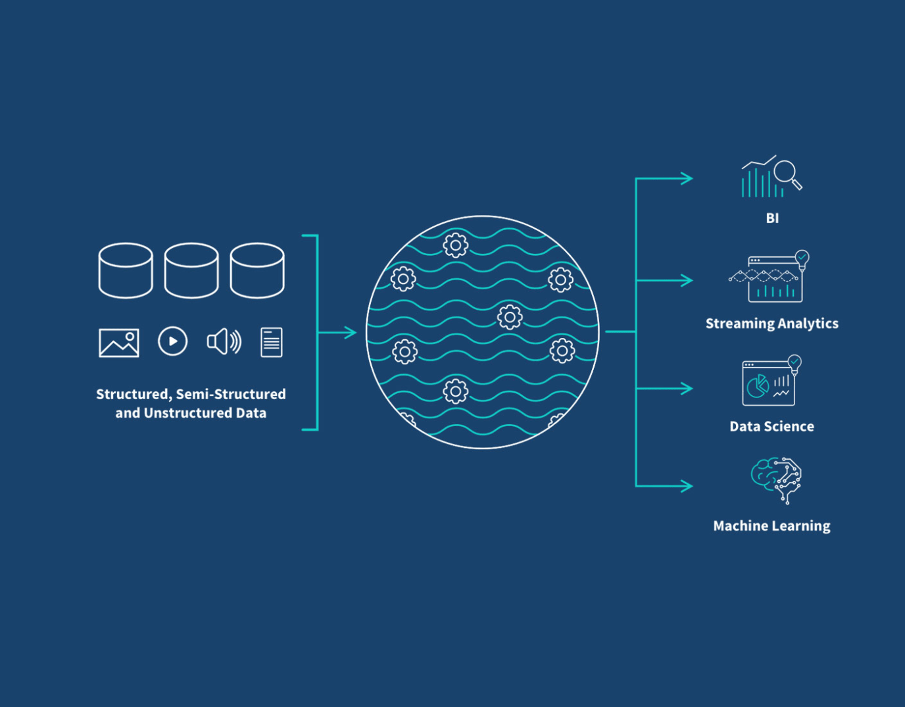

# Data Warehousing & Dimensional Modeling

---

## 1. Data Warehouse

### What is a Data Warehouse?

A **data warehouse** is a centralized repository that stores structured data from various sources, enabling efficient querying and analysis. It is specifically designed for analytical workloads (OLAP) rather than transactional processing (OLTP).

### Data Warehouse Architecture



Data flows from multiple sources into the data warehouse through ETL/ELT pipelines:

```
┌─────────────┐     ┌─────────────┐     ┌─────────────────┐
│   SOURCES   │ ──► │   ETL/ELT   │ ──► │  DATA WAREHOUSE │
├─────────────┤     │   PIPELINE  │     │                 │
│   APIs      │     │             │     │   Structured    │
│   RDBMS     │     │  Extract    │     │   Queryable     │
│   Websites  │     │  Transform  │     │   Historical    │
│   IoT       │     │  Load       │     │                 │
└─────────────┘     └─────────────┘     └─────────────────┘
```

---

## 2. ETL vs. ELT

ETL and ELT are two different approaches to data integration.



### ETL (Extract, Transform, Load)

In ETL, data is:
1. **Extracted** from source systems
2. **Transformed** in a staging area (cleaned, joined, aggregated)
3. **Loaded** into the data warehouse

**Advantages:**
- Most structured way to organize data
- Data is clean before entering the warehouse
- Better for complex transformations

**Use Case:** Most real-world implementations

### ELT (Extract, Load, Transform)

In ELT, data is:
1. **Extracted** from source systems
2. **Loaded** directly into the data warehouse
3. **Transformed** on the fly using SQL queries

**Advantages:**
- Leverages modern cloud warehouse compute power
- Raw data is always available for reprocessing

**Challenges:**
- Real-world data is often messy
- Complex transformations can be difficult in the warehouse
- Less successful in practice

> **Key Insight:** ETL is more commonly used because real-world data requires significant processing before it can be effectively stored in a data warehouse. ELT is sometimes used for specific use cases where raw data needs to be preserved.

---

## 3. Dimensional Modeling

Dimensional modeling is a data modeling technique used in data warehousing that organizes data into **fact** and **dimension** tables, facilitating efficient querying and reporting.

### Why Dimensional Modeling?

In relational databases (OLTP), data is **normalized**—split into many small tables to reduce redundancy. However, this makes analytical queries slow because:

- You need to join many tables (sometimes 4-5+) to get a single answer
- OLTP databases are row-oriented, making aggregations inefficient
- They are not designed for analytical workloads

**Dimensional modeling solves this** by creating a structure optimized for reading and aggregating data.

### Fact Tables

Fact tables store **quantitative data points** that can be measured in the business.

**Examples:**
- Sales amount
- Quantity sold
- Revenue
- Profit
- Units ordered

**Characteristics:**
- Contains measurable, numeric values
- Often has foreign keys to dimension tables
- Usually the largest table in the schema

### Dimension Tables

Dimension tables store **descriptive information** about the data.

**Examples:**
- Product name
- Product category
- User name
- User city
- Order status
- Date information

**Characteristics:**
- Contains descriptive attributes
- Smaller than fact tables
- Provides context to the fact data

### Fact & Dimension Relationship



```
┌─────────────────────────────────────────────────────────────┐
│                    DIMENSIONAL MODEL                        │
├─────────────────────────────────────────────────────────────┤
│                                                             │
│   ┌──────────────┐                                         │
│   │   DIMENSION  │                                         │
│   │    TABLE     │                                         │
│   │              │         ┌─────────────────┐             │
│   │  Product ID  │◄────────│                 │             │
│   │  Name        │         │    FACT TABLE   │             │
│   │  Category    │         │                 │             │
│   └──────────────┘         │  Order ID (PK)  │             │
│                            │  Product ID (FK)│──┐          │
│   ┌──────────────┐         │  User ID (FK)   │  │          │
│   │   DIMENSION  │         │  Date ID (FK)   │  │          │
│   │    TABLE     │         │  Quantity       │  │          │
│   │              │         │  Price          │  │          │
│   │   User ID    │◄────────│  Revenue        │  │          │
│   │   Name       │         └─────────────────┘  │          │
│   │   City       │                              │          │
│   └──────────────┘                              │          │
│                                                  │          │
│   ┌──────────────┐                               │          │
│   │   DIMENSION  │                               │          │
│   │    TABLE     │                               │          │
│   │              │         ┌─────────────────┐   │          │
│   │   Date ID    │◄────────│   DIMENSION     │   │          │
│   │   Year       │         │    TABLE        │   │          │
│   │   Month      │         │                 │   │          │
│   │   Quarter    │         │  Order ID (FK)  │   │          │
│   └──────────────┘         │  Status         │   │          │
│                            │  Created Date   │   │          │
│                            └─────────────────┘   │          │
│                                                  │          │
└──────────────────────────────────────────────────┴──────────┘
```

---

## 4. Star Schema vs. Snowflake Schema

Dimensional models are built using two main methodologies.



### Star Schema

A star schema is a type of dimensional model where a **central fact table** is connected to **multiple dimension tables**.

**Characteristics:**
- Fact table in the center
- Dimension tables directly attached to the fact
- Shape resembles a star

**Advantages:**
- Simple to understand
- Fast query performance
- Easy to build and maintain

**Disadvantages:**
- Data redundancy in dimension tables
- More storage space required

### Snowflake Schema

A snowflake schema is a more complex type of dimensional model where **dimension tables are normalized** into multiple related tables.

**Characteristics:**
- Fact table in the center
- Dimension tables branch into sub-dimensions
- Shape resembles a snowflake

**Advantages:**
- Reduces data redundancy
- Improves data integrity
- Saves storage space

**Disadvantages:**
- More complex queries
- Slower performance
- Harder to maintain

> **Note:** Snowflake schema is different from Snowflake, the cloud data warehouse company.

---

## 5. Slowly Changing Dimensions (SCD)

SCD is a technique used in dimensional modeling to manage **changes in dimension data over time**. It allows for tracking historical data and preserving previous values.



### Why Do We Need SCD?

- Business dimensions (customer addresses, product names) change slowly over time
- We need to track these changes for accurate historical reporting
- Different business requirements call for different tracking approaches

---

### SCD Type 1: Overwrite

**How it works:**
When a change occurs, the existing record is updated with the new value. The previous value is **overwritten** and **history is lost**.

**Example:**
```
Customer moves from New York to New Jersey

Before:  City = New York
After:   City = New Jersey (overwritten)
```

**When to use:**
- Attributes that don't need historical tracking
- Current address
- Current phone number

**Characteristics:**
- No history maintained
- Simple to implement
- Fast performance

---

### SCD Type 2: Full History

**How it works:**
When a change occurs, a **new record** is created with the updated value. The previous record is preserved with its original value.

**Example:**
```
Customer moves from New York → New Jersey → Miami

Record 1: City = New York, Active = FALSE, Start = 2020-01-01, End = 2023-01-01
Record 2: City = New Jersey, Active = FALSE, Start = 2023-01-01, End = 2024-06-01
Record 3: City = Miami, Active = TRUE, Start = 2024-06-01, End = NULL
```

**Tracking methods:**
- **Flag column:** Active = TRUE/FALSE
- **Version number:** Version 1, 2, 3
- **Date columns:** Start Date and End Date

**When to use:**
- Attributes that require complete historical tracking
- Customer previous addresses
- Employment history
- Product price changes

**Characteristics:**
- Complete history maintained
- More storage required
- Accurate historical reporting

---

### SCD Type 3: Limited History

**How it works:**
When a change occurs, the existing record is updated with the new value, and a **separate column** stores the previous value.

**Example:**
```
Customer moves from New York to New Jersey

Before:  Current City = New York, Previous City = NULL
After:   Current City = New Jersey, Previous City = New York
```

**When to use:**
- Attributes that need tracking of only the most recent change
- Current and previous subscription plans
- Current and previous manager

**Characteristics:**
- Only current and previous values tracked
- Limited history
- Moderate complexity

---

### SCD Type 6: Hybrid Approach

**How it works:**
Combines elements of SCD1, SCD2, and SCD3.

**Example:**
```
Customer moves from New York → New Jersey

Record: Current City = New Jersey, 
        Previous City = New York,
        Start Date = 2023-01-01,
        End Date = NULL,
        Active = TRUE
```

**Characteristics:**
- Captures current value (like SCD1)
- Preserves previous value (like SCD3)
- Maintains active flag (like SCD2)
- Tracks start and end dates (like SCD2)
- Most comprehensive approach



---

## 6. Data Marts

A **data mart** is a subset of a data warehouse that focuses on a specific business area or department.



### Why Data Marts?

- Different teams have different reporting needs
- Not every team needs access to the entire data warehouse
- Teams want to solve their own department's problems

### How Data Marts Work

```
┌─────────────────────────────────────────────────────────────┐
│                     DATA WAREHOUSE                         │
├─────────────────────────────────────────────────────────────┤
│                                                             │
│  ┌──────────┐  ┌──────────┐  ┌──────────┐  ┌──────────┐  │
│  │ Product  │  │  Order   │  │  User    │  │ Payment  │  │
│  │ Dimension│  │Dimension │  │Dimension │  │Dimension │  │
│  └──────────┘  └──────────┘  └──────────┘  └──────────┘  │
│        │            │            │            │            │
│        └────────────┼────────────┼────────────┘            │
│                     │            │                         │
│                     ▼            ▼                         │
│          ┌──────────────────────────┐                      │
│          │       DATA MART          │                      │
│          │   (Shipping Department)  │                      │
│          │                          │                      │
│          │  - Order ID              │                      │
│          │  - Product Name          │                      │
│          │  - User Name             │                      │
│          │  - Shipping Status       │                      │
│          │  - Delivery Date         │                      │
│          └──────────────────────────┘                      │
│                    │                                        │
│                    ▼                                        │
│          ┌──────────────────────────┐                      │
│          │   Shipping Department    │                      │
│          │   Reports & Dashboards   │                      │
│          └──────────────────────────┘                      │
└─────────────────────────────────────────────────────────────┘
```

### Benefits of Data Marts

- **Department-specific:** Tailored to specific team needs
- **Simplified:** Only necessary data and columns
- **Faster queries:** Smaller dataset to query
- **Independent:** Teams can build their own reporting

---

## 7. Data Lake

A **data lake** is a storage repository that holds a vast amount of raw data in its native format, including structured, semi-structured, and unstructured data.


### Key Concepts

**What it is:**
- Centralized repository (e.g., Amazon S3, Azure Data Lake, Google Cloud Storage)
- Store data as-is (CSV, Parquet, JSON, images, logs)
- No ETL required before storage

**Schema-on-Read:**
- Schema is defined when reading the data, not when writing it
- Greater flexibility for handling diverse data types
- Different teams can read different columns as needed

### Data Lake Workflow

```
┌─────────────────────────────────────────────────────────────┐
│                      DATA LAKE                             │
├─────────────────────────────────────────────────────────────┤
│                                                             │
│  ┌─────────────────────────────────────────────────────┐   │
│  │                   RAW DATA                          │   │
│  ├───────────┬───────────┬───────────┬───────────────┤   │
│  │   CSV     │  Parquet  │   JSON    │    Images     │   │
│  │   Files   │   Files   │   Files   │    / Logs     │   │
│  └───────────┴───────────┴───────────┴───────────────┘   │
│                        │                                   │
│                        ▼                                   │
│              ┌─────────────────┐                          │
│              │  SCHEMA-ON-READ │                          │
│              │                 │                          │
│              │  Define schema  │                          │
│              │  when querying  │                          │
│              └────────┬────────┘                          │
│                       │                                    │
│         ┌─────────────┼─────────────┐                     │
│         ▼             ▼             ▼                     │
│  ┌─────────────┐ ┌───────────┐ ┌─────────────────────┐   │
│  │  Data       │ │  Data     │ │  Machine Learning   │   │
│  │  Analysts   │ │  Scientists││  / Data Science     │   │
│  └─────────────┘ └───────────┘ └─────────────────────┘   │
│                                                             │
└─────────────────────────────────────────────────────────────┘
```

### Why Use a Data Lake?

**Advantages:**
- Store any type of data (structured, semi-structured, unstructured)
- No need to define schema upfront
- Data scientists can access raw data for ML models
- Cost-effective storage (especially in cloud)
- Supports real-time and streaming data

**Disadvantages:**
- Can become a "data swamp" without governance
- Query performance slower than data warehouses
- Requires schema-on-read skills

---

## 8. Data Lake vs. Data Warehouse

| Feature | Data Lake | Data Warehouse |
|:---|:---|:---|
| **Data Structure** | Unstructured, semi-structured, structured | Structured only |
| **Storage Format** | Raw data as-is (CSV, Parquet, JSON, logs) | Predefined schemas (rows and columns) |
| **Schema** | Schema-on-read | Schema-on-write |
| **Users** | Data scientists, data analysts, ML engineers | Business analysts, BI users |
| **Use Cases** | Machine learning, real-time analysis, big data | BI reporting, dashboards, historical analysis |
| **Data Size** | Very large (PB+) | Smaller (GB-TB) |
| **Processing** | Batch and stream processing | Primarily batch processing |
| **Examples** | Amazon S3, Azure Data Lake, GCS | Snowflake, Redshift, BigQuery |


---

## 9. Summary: Quick Reference

| Concept | Definition | Key Takeaway |
|:---|:---|:---|
| **Data Warehouse** | Centralized repository for structured data | Optimized for analytics |
| **ETL** | Extract → Transform → Load | Most common approach |
| **ELT** | Extract → Load → Transform | Transform in the warehouse |
| **Fact Table** | Stores quantitative business metrics | Sales amount, quantity, revenue |
| **Dimension Table** | Stores descriptive attributes | Product name, user city, date |
| **Star Schema** | Fact + dimensions directly attached | Simple, fast performance |
| **Snowflake Schema** | Normalized dimensions | Less redundancy, more complex |
| **SCD Type 1** | Overwrite values | No history tracked |
| **SCD Type 2** | Create new rows | Full history tracked |
| **SCD Type 3** | Separate previous value column | Limited history |
| **SCD Type 6** | Hybrid approach | Current + previous + active flag |
| **Data Mart** | Subset of data warehouse | Department-specific |
| **Data Lake** | Raw data repository | Any data type, schema-on-read |

---

**✅ You have completed Part 3: Data Warehousing & Dimensional Modeling**

---

*End of Part 3: Data Warehousing & Dimensional Modeling*