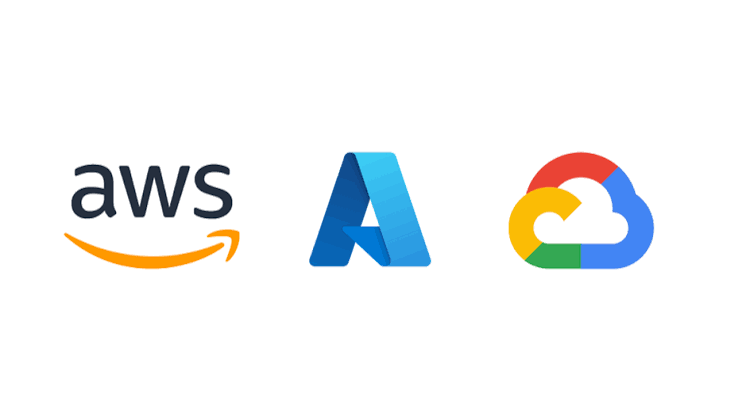
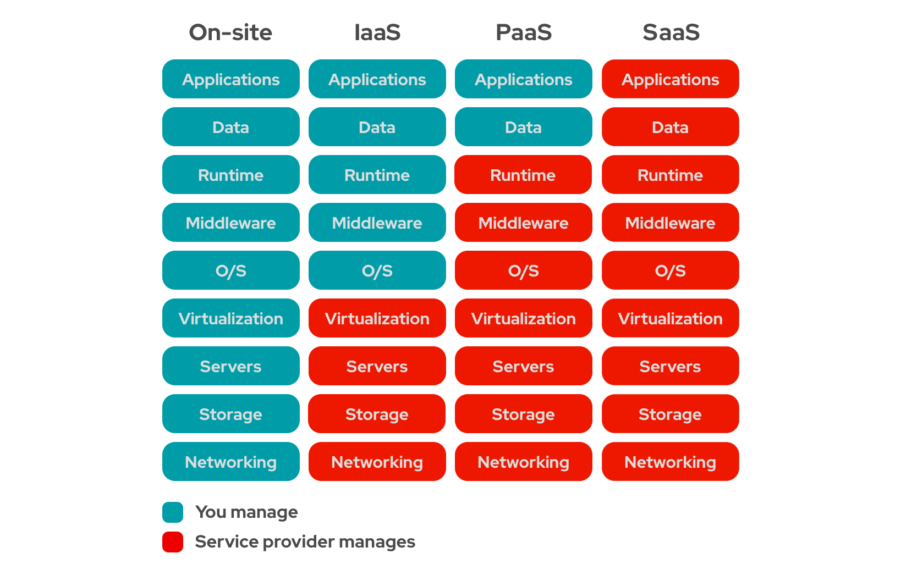
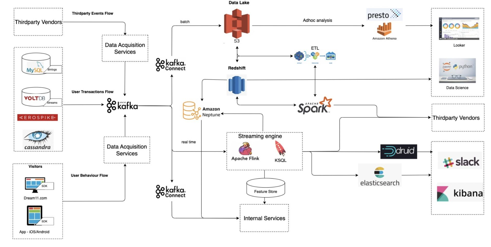

# Cloud for Data Engineering

---

## 1. Why Cloud Computing for Data Engineering?

Cloud computing has revolutionized data engineering by providing on-demand access to computing resources, storage, and services without the need for upfront infrastructure investment.



### Key Benefits of Cloud Computing

| Benefit | Description |
|:---|:---|
| **Pay-as-you-go Model** | No upfront costs for hardware and software. Only pay for what you use. |
| **Scalability** | Scale up or down based on demand. Handle sudden spikes in data volume. |
| **High Availability** | Cloud providers offer multiple data centers and redundancy. |
| **Security** | Built-in security features and compliance certifications. |
| **Flexibility** | Choose from a variety of services and tools for different use cases. |
| **Collaboration** | Work with teams across the globe seamlessly. |

### Before the Cloud: On-Premise Challenges

Before cloud computing, companies had to build and maintain their own data centers:

```
┌─────────────────────────────────────────────────────────────┐
│                 ON-PREMISE DATA CENTER                     │
├─────────────────────────────────────────────────────────────┤
│                                                             │
│   ❌ High upfront costs (hardware, networking, cooling)    │
│   ❌ Manual maintenance and upgrades                       │
│   ❌ Power outages and hardware failures                   │
│   ❌ Difficult to scale quickly                            │
│   ❌ Disaster recovery challenges                          │
│   ❌ Need to run 24/7 even for small workloads             │
│                                                             │
└─────────────────────────────────────────────────────────────┘
```

### The Cloud Advantage

With cloud computing, you can:
- **Rent resources** for specific workloads
- **Stop paying** when you don't need them
- **Scale automatically** based on demand
- **Focus on code** instead of infrastructure

---

## 2. Cloud Service Models

Cloud services are divided into three main categories:



### 1. Infrastructure as a Service (IaaS)

**What it is:** Virtualized computing resources over the internet.

**Characteristics:**
- You manage the operating system, applications, and data
- Cloud provider manages the hardware, networking, and storage
- Maximum control and flexibility

**Examples:**
- AWS EC2 (Elastic Compute Cloud)
- Google Compute Engine
- Microsoft Azure Virtual Machines

**Use Case:** Running custom applications, hosting websites, data processing clusters.

---

### 2. Platform as a Service (PaaS)

**What it is:** A platform for developers to build, deploy, and manage applications without worrying about the underlying infrastructure.

**Characteristics:**
- Cloud provider manages everything except your code
- Focus on writing code and business logic
- Automatic scaling and maintenance

**Examples:**
- AWS Elastic Beanstalk
- Google App Engine
- Microsoft Azure App Service

**Use Case:** Developing web applications, API backends, microservices.

---

### 3. Software as a Service (SaaS)

**What it is:** Software applications provided over the internet, eliminating the need for installation and maintenance.

**Characteristics:**
- Fully managed by the provider
- Accessible via web browser
- No installation or maintenance required

**Examples:**
- Google Workspace (Gmail, Docs, Sheets)
- Microsoft Office 365
- Salesforce

**Use Case:** Email, collaboration tools, CRMs, enterprise applications.

---

## 3. The Three Major Cloud Providers

### Comparison Overview

| Feature | AWS | Azure | GCP |
|:---|:---|:---|:---|
| **Market Share** | Largest | Second | Third |
| **Best For** | Startups, flexibility | Enterprise, Microsoft integration | Analytics, AI/ML |
| **Data Warehouse** | Redshift | Synapse Analytics | BigQuery |
| **Object Storage** | S3 | Blob Storage | Cloud Storage |
| **Serverless Compute** | Lambda | Functions | Cloud Functions |
| **Big Data Processing** | EMR, Glue | Databricks, Data Factory | DataProc, Dataflow |
| **Strengths** | Wide ecosystem, mature services | Enterprise integration, strong tooling | BigQuery, AI/ML capabilities |

### Which Cloud Should You Learn?

**Personal Opinion (Based on Industry Trends):**

| Target | Recommended Cloud |
|:---|:---|
| **Startups** | AWS (good credits, easy to start, large talent pool) |
| **Enterprise Companies** | Azure (Microsoft integration, enterprise security) |
| **Data/AI Focused** | GCP (BigQuery, TensorFlow, AI tools) |

> **Note:** Most companies use a **multi-cloud** or **hybrid cloud** approach, leveraging the best services from each provider.

---

## 4. AWS Data Engineering Services


AWS provides a comprehensive suite of services for data engineering:

### Storage Services

| Service | Purpose |
|:---|:---|
| **S3 (Simple Storage Service)** | Object storage for data lakes |
| **EBS (Elastic Block Store)** | Block storage for EC2 instances |
| **EFS (Elastic File System)** | File storage for multiple instances |

### Compute Services

| Service | Purpose |
|:---|:---|
| **EC2 (Elastic Compute Cloud)** | Virtual machines for any workload |
| **Lambda** | Serverless compute for event-driven tasks |
| **EMR (Elastic MapReduce)** | Managed Hadoop/Spark clusters |

### Data Processing Services

| Service | Purpose |
|:---|:---|
| **AWS Glue** | Serverless ETL and Spark jobs |
| **EMR** | Managed Spark, Hadoop, and Hive clusters |
| **Kinesis** | Real-time data streaming |

### Data Warehousing & Analytics

| Service | Purpose |
|:---|:---|
| **Redshift** | Petabyte-scale data warehouse |
| **Athena** | Serverless query service for S3 data |
| **QuickSight** | Business intelligence and dashboards |

### Databases

| Service | Purpose |
|:---|:---|
| **RDS** | Managed relational databases (PostgreSQL, MySQL, etc.) |
| **DynamoDB** | NoSQL key-value and document database |
| **ElastiCache** | In-memory caching (Redis, Memcached) |

### Other Important Services

| Service | Purpose |
|:---|:---|
| **MSK (Managed Streaming for Kafka)** | Managed Apache Kafka |
| **SNS (Simple Notification Service)** | Pub/sub messaging |
| **SQS (Simple Queue Service)** | Message queuing |
| **API Gateway** | Create, publish, and manage APIs |
| **IAM (Identity and Access Management)** | Security and access control |

---

## 5. Case Study: Dream11 Data Architecture on AWS



Dream11, India's leading fantasy sports platform, built their data architecture on AWS. Let's break down their system using the Data Engineering Lifecycle.

### Source Layer (Data Generation)

Data comes from multiple sources:

```
┌─────────────────────────────────────────────────────────────┐
│                      DATA SOURCES                          │
├───────────┬───────────┬───────────┬───────────┬───────────┤
│  Android  │   iOS     │   Web     │  MySQL   │ Cassandra │
│   App     │   App     │  Dream11  │  (RDBMS) │  (NoSQL)  │
│           │           │   .com    │          │           │
└───────────┴───────────┴───────────┴───────────┴───────────┘
                         │
                         ▼
              ┌─────────────────┐
              │   APACHE KAFKA  │  ← Real-time streaming ingestion
              │   (Producers)   │
              └─────────────────┘
```

### Ingestion Layer

**Apache Kafka** is used for real-time data streaming:
- **Producers:** All data sources (apps, databases, vendors) send data to Kafka
- **Consumers:** Multiple systems consume data from Kafka for different purposes

### Storage Layer (Data Lake)

**Amazon S3** serves as the data lake:

```
┌─────────────────────────────────────────────────────────────┐
│                    AMAZON S3 (DATA LAKE)                   │
├─────────────────────────────────────────────────────────────┤
│                                                             │
│  ┌──────────┐  ┌──────────┐  ┌──────────┐  ┌──────────┐  │
│  │   Raw    │  │  Parquet │  │   JSON   │  │   CSV    │  │
│  │   Data   │  │   Files  │  │   Files  │  │   Files  │  │
│  └──────────┘  └──────────┘  └──────────┘  └──────────┘  │
│                                                             │
└─────────────────────────────────────────────────────────────┘
```

### Processing & Transformation Layer

**Two types of pipelines:**

#### 1. Batch Pipeline

```
┌─────────────┐     ┌─────────────────┐     ┌─────────────────┐
│   S3 Data   │ ──► │  Apache Spark   │ ──► │   Amazon        │
│   (Data     │     │  (ETL on EMR)   │     │   Redshift      │
│    Lake)    │     │                 │     │   (Data         │
└─────────────┘     └─────────────────┘     │   Warehouse)    │
                                            └─────────────────┘
```

#### 2. Real-time Pipeline

```
┌─────────────┐     ┌─────────────────┐     ┌─────────────────┐
│   Apache    │ ──► │   Apache Flink  │ ──► │  Elasticsearch  │
│   Kafka     │     │   (Streaming)   │     │  / Real-time    │
│             │     │                 │     │  Analysis       │
└─────────────┘     └─────────────────┘     └─────────────────┘
```

### Serving Layer

**Two paths for consuming data:**

#### 1. Structured Data (Redshift)

```
┌─────────────────┐
│   Redshift      │
│   (Structured)  │
└────────┬────────┘
         │
         ▼
┌─────────────────┐
│   Looker / BI   │  ← Business dashboards
│   Tools         │
└─────────────────┘
```

#### 2. Raw Data (Ad Hoc Analysis)

```
┌─────────────────┐
│   Amazon Athena │  ← Serverless query engine
│   (Ad Hoc)      │
└────────┬────────┘
         │
         ▼
┌─────────────────┐
│   Jupyter       │  ← Data Science / ML
│   Notebooks     │
└─────────────────┘
```

### Dream11 Architecture Summary

| Lifecycle Stage | Dream11 Implementation |
|:---|:---|
| **Generation** | Android/iOS apps, MySQL, Cassandra, third-party vendors |
| **Ingestion** | Apache Kafka (real-time streaming) |
| **Storage** | Amazon S3 (data lake) |
| **Batch Processing** | Apache Spark on EMR |
| **Real-time Processing** | Apache Flink |
| **Structured Data** | Amazon Redshift (data warehouse) |
| **Ad Hoc Analysis** | Amazon Athena |
| **Visualization** | Looker, BI tools |
| **Data Science** | Jupyter Notebooks |

### Key Learning

> **Every architecture follows the Data Engineering Lifecycle:** Generation → Ingestion → Storage → Transformation → Serving. The tools may change, but the fundamental concepts remain the same.

---

## 6. GCP Data Engineering Services

Google Cloud Platform (GCP) provides similar services with their own branding:

### GCP Services Overview

| AWS Service | GCP Equivalent |
|:---|:---|
| **S3** | Cloud Storage |
| **Redshift** | BigQuery |
| **EMR** | DataProc |
| **Glue** | Dataflow / DataPrep |
| **Lambda** | Cloud Functions |
| **RDS** | Cloud SQL |
| **Kinesis** | Pub/Sub |
| **Kafka** | Pub/Sub (managed) |

### GCP Data Engineering Architecture

```
┌─────────────────────────────────────────────────────────────┐
│                    GCP DATA PIPELINE                        │
├─────────────────────────────────────────────────────────────┤
│                                                             │
│  ┌─────────┐    ┌─────────────┐    ┌─────────────────┐    │
│  │  Cloud   │ ──►│   Pub/Sub   │ ──►│    Dataflow     │    │
│  │ Storage  │    │  (Ingest)   │    │  (Processing)   │    │
│  │ (Data    │    │             │    │                 │    │
│  │  Lake)   │    └─────────────┘    └────────┬────────┘    │
│  └─────────┘                                  │             │
│                                                ▼             │
│                        ┌─────────────────────────────────┐  │
│                        │         BigQuery               │  │
│                        │      (Data Warehouse)          │  │
│                        └─────────────────────────────────┘  │
│                                                │             │
│                              ┌─────────────────┼───────────┐ │
│                              ▼                 ▼           ▼ │
│                      ┌─────────────┐ ┌─────────────┐ ┌─────────┐│
│                      │   Looker    │ │  Jupyter    │ │  Apps   ││
│                      │   (BI)      │ │ (Data Sci)  │ │         ││
│                      └─────────────┘ └─────────────┘ └─────────┘│
│                                                             │
└─────────────────────────────────────────────────────────────┘
```

### BigQuery: GCP's Data Warehouse

**Why BigQuery is special:**
- Serverless data warehouse
- Petabyte-scale analytics
- Built-in machine learning (BigQuery ML)
- Real-time analytics capabilities
- Separation of storage and compute

---

## 7. Azure Data Engineering Services

Microsoft Azure offers strong data engineering services, especially for enterprise customers.

### Azure Services Overview

| AWS Service | Azure Equivalent |
|:---|:---|
| **S3** | Blob Storage / ADLS Gen2 |
| **Redshift** | Synapse Analytics (formerly SQL DW) |
| **EMR** | HDInsight |
| **Glue** | Data Factory |
| **Lambda** | Functions |
| **RDS** | SQL Database |
| **Kinesis** | Event Hubs |
| **Kafka** | Event Hubs (with Kafka support) |
| **Databricks** | Azure Databricks (fully integrated) |

### Key Azure Services for Data Engineering

| Service | Purpose |
|:---|:---|
| **Azure Databricks** | Managed Apache Spark environment |
| **Azure Data Factory** | ETL and orchestration |
| **Azure Synapse Analytics** | Unified data warehouse and analytics |
| **Azure Data Lake Storage (ADLS)** | Scalable data lake storage |
| **Microsoft Fabric** | All-in-one data platform (newest offering) |

### Azure Data Engineering Architecture Example

```
┌─────────────────────────────────────────────────────────────┐
│                   AZURE DATA PIPELINE                       │
├─────────────────────────────────────────────────────────────┤
│                                                             │
│  ┌─────────┐    ┌─────────────┐    ┌─────────────────┐    │
│  │  ADLS   │ ──►│   Data      │ ──►│   Databricks    │    │
│  │  (Data  │    │   Factory   │    │  (Processing)   │    │
│  │  Lake)  │    │  (ETL)      │    │                 │    │
│  └─────────┘    └─────────────┘    └────────┬────────┘    │
│                                                │             │
│                                                ▼             │
│                        ┌─────────────────────────────────┐  │
│                        │    Synapse Analytics            │  │
│                        │      (Data Warehouse)           │  │
│                        └─────────────────────────────────┘  │
│                                                │             │
│                              ┌─────────────────┼───────────┐ │
│                              ▼                 ▼           ▼ │
│                      ┌─────────────┐ ┌─────────────┐ ┌─────────┐│
│                      │  Power BI   │ │  ML Studio  │ │  Apps   ││
│                      │  (BI)       │ │  (Data Sci) │ │         ││
│                      └─────────────┘ └─────────────┘ └─────────┘│
│                                                             │
└─────────────────────────────────────────────────────────────┘
```

---

## 8. The Modern Data Stack

Modern data companies are challenging traditional ETL approaches. They promote **ELT** (Extract, Load, Transform) over **ETL** (Extract, Transform, Load).


### Traditional vs Modern Approach

```
TRADITIONAL (ETL):
┌─────────┐     ┌─────────────────┐     ┌─────────────────┐
│ Extract │ ──► │   Transform     │ ──► │      Load       │
│ (Sources│     │   (Staging)     │     │   (Warehouse)   │
└─────────┘     └─────────────────┘     └─────────────────┘

MODERN (ELT):
┌─────────┐     ┌─────────────────┐     ┌─────────────────┐
│ Extract │ ──► │      Load       │ ──► │   Transform     │
│ (Sources│     │   (Warehouse)   │     │   (In Warehouse)│
└─────────┘     └─────────────────┘     └─────────────────┘
```

### Modern Data Stack Components

| Layer | Modern Tools | Purpose |
|:---|:---|:---|
| **Ingestion** | Fivetran, Airbyte, Stitch | Connect to sources, load data |
| **Storage** | Snowflake, BigQuery, Redshift | Data warehouse/lake |
| **Transformation** | dbt (Data Build Tool) | Transform in warehouse |
| **Orchestration** | Airflow, Dagster, Prefect | Schedule and manage workflows |
| **BI/Analytics** | Looker, Tableau, Power BI | Dashboards and reporting |
| **Reverse ETL** | Hightouch, Census | Send transformed data back to sources |

### Key Modern Data Stack Concepts

#### 1. Extract & Load First
- Load raw data directly into the warehouse
- Transform later using warehouse compute power
- Faster time-to-insight

#### 2. dbt (Data Build Tool)
- Write transformations as SQL
- Version control for data models
- Testing and documentation built-in
- Popular in modern data stacks

#### 3. Reverse ETL
- Send transformed data back to operational systems
- Close the loop between analytics and operations
- Examples: Send customer segments to marketing tools

#### 4. Data Lakehouse
- Combines data lake and data warehouse benefits
- Stores raw data (like a lake)
- Provides structured querying (like a warehouse)
- Examples: Delta Lake, Iceberg, Hudi

---

## 9. Summary: Cloud & Data Engineering

### Key Takeaways

| Concept | Key Points |
|:---|:---|
| **Why Cloud** | Pay-as-you-go, scalability, no upfront costs, global reach |
| **Service Models** | IaaS (hardware), PaaS (platform), SaaS (software) |
| **AWS** | S3 (lake), Redshift (warehouse), Glue/EMR (processing), Kafka (ingest) |
| **GCP** | Cloud Storage (lake), BigQuery (warehouse), Dataflow (processing), Pub/Sub (ingest) |
| **Azure** | ADLS (lake), Synapse (warehouse), Databricks (processing), Event Hubs (ingest) |
| **Modern Stack** | ELT > ETL, dbt for transformations, reverse ETL |
| **Fundamental Rule** | Everything follows the Data Engineering Lifecycle |

### The Dream11 Case Study Lesson

> **You can now understand any data architecture in the world.** Once you know the fundamental lifecycle, you can look at any architecture and identify:
>
> - Where is the data coming from? (Generation)
> - How is it being ingested? (Ingestion)
> - Where is it stored? (Storage)
> - How is it processed? (Transformation)
> - How is it served? (Serving)
>
> The tools may change, but the fundamentals remain the same.

### Multi-Cloud & Hybrid Cloud

You don't have to choose just one cloud provider:

```
┌─────────────────────────────────────────────────────────────┐
│                    MULTI-CLOUD APPROACH                     │
├─────────────────────────────────────────────────────────────┤
│                                                             │
│   ┌─────────────┐    ┌─────────────┐    ┌─────────────┐   │
│   │    AWS      │    │    GCP      │    │   Azure     │   │
│   ├─────────────┤    ├─────────────┤    ├─────────────┤   │
│   │  S3 (Data   │    │  BigQuery   │    │ Databricks  │   │
│   │  Lake)      │    │  (Warehouse)│    │ (Processing)│   │
│   └─────────────┘    └─────────────┘    └─────────────┘   │
│                                                             │
│   Each provider has strengths. Choose the best for each    │
│   component of your architecture.                          │
└─────────────────────────────────────────────────────────────┘
```

---

**✅ You have completed Part 4: Cloud for Data Engineering**

---

*End of Part 4: Cloud for Data Engineering*